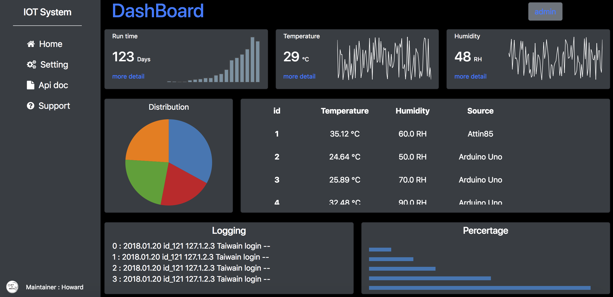

###   DashBoard 

 

Build Owner Dashboard

# What is Dashboard ?
[grafana](https://grafana.com/grafana/download?platform=mac)

[famous](https://speckyboy.com/beautifully-designed-admin-dashboards/)

## Package
* [Flask](http://flask.pocoo.org)
* [Jinja2](http://jinja.pocoo.org/docs/dev/templates)
* [Flask-resrful](https://flask-restful.readthedocs.io/en/latest/)
* [Flask-sqlachemy ](http://flask-sqlalchemy.pocoo.org/2.3/)
* [Flask-Migrate ](https://flask-migrate.readthedocs.io/en/latest/)
* [Flask-bcrypt ](http://flask-bcrypt.readthedocs.io/en/latest/)
* [WTForms](https://wtforms.readthedocs.io/en/stable/)
* [pytest](https://docs.pytest.org/en/latest/index.html)
* [flask-login](https://flask-login.readthedocs.io/en/latest/)

---
> git clone url filename

Set Python Enviroment

<pre>
MacOS 
> $ virtualenv -p python3 env
> $ source env/bin/activate
> $ pip3 install -r requirements.txt
</pre>

Pytest
---